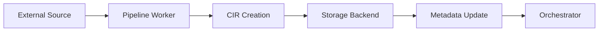
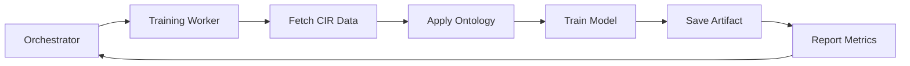
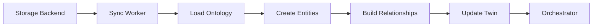

## Overview

Mimir AIP consists of two core binaries and an optional web frontend, designed for scalable data processing, ML model training, and digital twin management across distributed Kubernetes environments.

## System Architecture

```
┌──────────────────────────────────────────────────────┐
│                      Client Layer                    │
│   Web Frontend (port 3000)   │   MCP Client / Agent  │
└──────────────┬───────────────┴──────────┬────────────┘
               │  REST API                │  SSE (MCP)
               ▼                          ▼
┌─────────────────────────────────────────────────────┐
│                    Orchestrator                     │
│  ┌──────────┐  ┌──────────┐  ┌──────────────────┐  │
│  │ Projects │  │Pipelines │  │   ML Models      │  │
│  │ Ontology │  │Schedules │  │   Digital Twins  │  │
│  │ Storage  │  │  Queue   │  │   MCP Server     │  │
│  └──────────┘  └────┬─────┘  └──────────────────┘  │
│          SQLite     │                               │
└─────────────────────┼───────────────────────────────┘
                      │  Kubernetes Jobs
                      ▼
           ┌─────────────────────┐
           │       Workers       │
           │  (pipeline, train,  │
           │   infer, DT sync)   │
           └──────────┬──────────┘
                      │
          ┌───────────▼───────────┐
          │   Storage Backends    │
          │  Filesystem · Postgres│
          │  MySQL · MongoDB · S3 │
          │  Redis · ES · Neo4j   │
          └───────────────────────┘
```

## Components

### Orchestrator

The orchestrator is a long-running HTTP server that serves as the central control plane for Mimir AIP.

<AccordionGroup>
  <Accordion title="Core Responsibilities" icon="gears">
    - Manages all persistent metadata in SQLite
      - Projects, pipelines, ontologies
      - ML models, digital twins
      - Storage configurations and schedules
    - Exposes REST API for all platform operations
    - Serves MCP tools via Server-Sent Events (SSE) endpoint
    - Dispatches worker jobs to Kubernetes clusters
    - Handles authentication and authorization
  </Accordion>

  <Accordion title="Storage" icon="database">
    The orchestrator uses SQLite as its metadata store, persisting to a volume-mounted directory (`/app/data` by default).

    All application data flows through storage backends configured per-project, not through the orchestrator's database.
  </Accordion>

  <Accordion title="Scalability" icon="chart-line">
    While the orchestrator is a single-instance service, it supports:
    - Concurrent worker jobs (configurable pool size)
    - Multi-cluster job dispatch (primary + overflow clusters)
    - Horizontal scaling of workers across Kubernetes nodes
  </Accordion>
</AccordionGroup>

**Configuration** is managed via environment variables. See [Configuration Reference](/deployment/configuration).

### Worker

Workers are short-lived Kubernetes Jobs spawned by the orchestrator to execute compute-intensive tasks.

<CardGroup cols={2}>
  <Card title="Pipeline Execution" icon="workflow">
    Runs ingestion, processing, and output pipeline steps sequentially, storing results as CIR objects.
  </Card>
  <Card title="ML Training" icon="brain">
    Trains decision trees, random forests, regression models, or neural networks from CIR data.
  </Card>
  <Card title="ML Inference" icon="wand-magic-sparkles">
    Executes trained models against new data for predictions or recommendations.
  </Card>
  <Card title="Digital Twin Sync" icon="arrows-rotate">
    Synchronizes digital twin entities with storage backends, applying ontology constraints.
  </Card>
</CardGroup>

<Info>
Workers are **stateless** and read all configuration from environment variables and orchestrator API calls. They report results back to the orchestrator upon completion.
</Info>

**Worker Lifecycle:**

1. Orchestrator enqueues a task (e.g., pipeline execution)
2. Job scheduler spawns a Kubernetes Job with task parameters
3. Worker pod starts, calls orchestrator API for full config
4. Worker executes the task (pipeline, training, inference, sync)
5. Worker reports results via orchestrator API
6. Job completes, pod is removed by Kubernetes

### Frontend

A lightweight React/TypeScript single-page application for managing Mimir resources.

- Communicates exclusively with the orchestrator REST API
- Served by a minimal Go HTTP server
- Runs on port 3000 by default
- Optional component (not required for MCP or programmatic use)

<Tip>
The frontend is ideal for visual exploration and configuration, but all operations are also available via REST API or MCP tools.
</Tip>

## Data Flow

### Ingestion Pipeline Flow



1. Pipeline worker connects to data source (API, database, file)
2. Raw data is converted to CIR format
3. CIR is stored in configured storage backend
4. Metadata is reported back to orchestrator
5. Orchestrator updates job status and notifies watchers

### ML Training Flow



1. Orchestrator spawns training worker with model definition
2. Worker retrieves training data as CIR from storage
3. Ontology constraints are applied for feature engineering
4. Model is trained with specified hyperparameters
5. Model artifact is saved to persistent storage
6. Training metrics reported to orchestrator

### Digital Twin Sync Flow



1. Sync worker fetches CIR data from storage
2. Ontology is loaded to define entity types and relationships
3. Entities are created or updated in digital twin
4. Relationships are established based on ontology rules
5. Digital twin state is persisted
6. Sync status reported to orchestrator

## Deployment Modes

<Tabs>
  <Tab title="Docker Compose">
    **Local development mode** — runs orchestrator and frontend in containers.

    ```bash
    docker compose up --build
    ```

    <Warning>
    Worker jobs are **not available** in Docker Compose mode. Use Kubernetes for full functionality.
    </Warning>

    **Suitable for:**
    - Local development and testing
    - API exploration
    - MCP integration testing
  </Tab>

  <Tab title="Kubernetes (Single Cluster)">
    **Standard production deployment** — orchestrator + workers on a single Kubernetes cluster.

    ```bash
    helm install mimir-aip ./helm/mimir-aip \
      --namespace mimir-aip \
      --create-namespace
    ```

    **Suitable for:**
    - Production deployments
    - Multi-tenant environments
    - Scalable workloads
  </Tab>

  <Tab title="Multi-Cluster">
    **Advanced deployment** — orchestrator on primary cluster, workers distributed across multiple clusters.

    Configure overflow clusters in orchestrator environment:

    ```yaml
    CLUSTER_POOL_PRIMARY: primary-cluster
    CLUSTER_POOL_OVERFLOW: cloud-cluster-1,cloud-cluster-2
    ```

    **Suitable for:**
    - High-volume workloads
    - Hybrid cloud deployments
    - Geographically distributed processing
  </Tab>
</Tabs>

## Network Communication

| Source | Destination | Protocol | Port | Purpose |
|--------|-------------|----------|------|----------|
| Frontend | Orchestrator | HTTP | 8080 | REST API calls |
| MCP Client | Orchestrator | SSE | 8080 | MCP tool requests |
| Worker | Orchestrator | HTTP | 8080 | Config fetch, result reporting |
| Worker | Storage Backend | TCP | varies | Data read/write operations |
| Orchestrator | Kubernetes API | HTTPS | 6443 | Job creation, status monitoring |

<Info>
All orchestrator communication is over HTTP. For production, use an ingress controller with TLS termination.
</Info>

## Configuration

See [Configuration Reference](/deployment/configuration) for complete environment variable documentation.

Key configuration areas:
- **Orchestrator**: Port, storage directory, log level
- **Workers**: Min/max pool size, queue threshold, namespace
- **Kubernetes**: Service account, cluster credentials
- **Storage**: Backend plugins, connection strings

## Observability

<CardGroup cols={2}>
  <Card title="Logs" icon="file-lines">
    Structured JSON logs from orchestrator and workers. Configure log level via `LOG_LEVEL` environment variable.
  </Card>
  <Card title="Metrics" icon="chart-line">
    Worker job status and duration tracked in orchestrator database. Query via REST API or MCP tools.
  </Card>
  <Card title="Health Checks" icon="heartbeat">
    `/health` endpoint on orchestrator. Returns 200 OK when service is ready.
  </Card>
  <Card title="Job Status" icon="list-check">
    Real-time job status via `/api/tasks` endpoint. Monitor pipeline, training, and sync operations.
  </Card>
</CardGroup>

## Next Steps

<CardGroup cols={2}>
  <Card title="Terminology" icon="book" href="/concepts/terminology">
    Learn key terms and concepts used throughout Mimir AIP.
  </Card>
  <Card title="Data Model" icon="database" href="/concepts/data-model">
    Understand the core data structures and relationships.
  </Card>
  <Card title="CIR Format" icon="file-code" href="/concepts/cir-format">
    Deep dive into the Common Internal Representation format.
  </Card>
  <Card title="Quick Start" icon="rocket" href="/quickstart">
    Get Mimir AIP running in your environment.
  </Card>
</CardGroup>