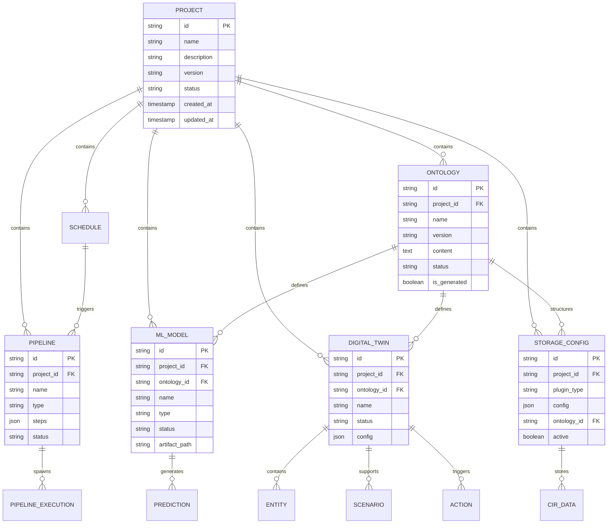

## Overview

Mimir AIP's data model is built around **Projects** as the top-level container, with resources organized hierarchically. All application data flows through the **CIR** (Common Internal Representation) format for consistency across storage backends.

## Entity Relationship Diagram



## Core Entities

### Project

<Card title="Project" icon="folder">
  Top-level organizational unit grouping all resources for a domain or use case.
</Card>

```go pkg/models/project.go:15
type Project struct {
    ID          string            `json:"id"`
    Name        string            `json:"name"`
    Description string            `json:"description"`
    Version     string            `json:"version"`
    Status      ProjectStatus     `json:"status"`
    Metadata    ProjectMetadata   `json:"metadata"`
    Components  ProjectComponents `json:"components"`
    Settings    ProjectSettings   `json:"settings"`
}

type ProjectComponents struct {
    Pipelines      []string `json:"pipelines"`
    Ontologies     []string `json:"ontologies"`
    MLModels       []string `json:"ml_models"`
    DigitalTwins   []string `json:"digital_twins"`
    StorageConfigs []string `json:"storage_configs"`
}
```

**Relationships:**
- One-to-many with Pipelines, Ontologies, Storage Configs, ML Models, Digital Twins, Schedules
- Projects are isolated — resources cannot cross project boundaries

**Status values:** `active`, `archived`, `draft`

### Pipeline

<Card title="Pipeline" icon="workflow">
  Ordered sequence of processing steps for data ingestion, transformation, or output.
</Card>

```go pkg/models/pipeline.go:24
type Pipeline struct {
    ID          string         `json:"id"`
    ProjectID   string         `json:"project_id"`
    Name        string         `json:"name"`
    Type        PipelineType   `json:"type"`        // ingestion, processing, output
    Description string         `json:"description"`
    Steps       []PipelineStep `json:"steps"`
    Status      PipelineStatus `json:"status"`
    CreatedAt   time.Time      `json:"created_at"`
    UpdatedAt   time.Time      `json:"updated_at"`
}

type PipelineStep struct {
    Name       string                 `json:"name"`
    Plugin     string                 `json:"plugin"`
    Action     string                 `json:"action"`
    Parameters map[string]interface{} `json:"parameters"`
    Output     map[string]string      `json:"output"`
}
```

**Relationships:**
- Belongs to one Project
- Can be triggered by multiple Schedules
- Spawns PipelineExecutions when run

**Pipeline types:**
- `ingestion` — Fetch data from external sources
- `processing` — Transform or analyze data
- `output` — Write results to destinations

### Ontology

<Card title="Ontology" icon="sitemap">
  OWL/Turtle vocabulary defining entity types, properties, and relationships for a domain.
</Card>

```go pkg/models/ontology.go:10
type Ontology struct {
    ID          string    `json:"id"`
    ProjectID   string    `json:"project_id"`
    Name        string    `json:"name"`
    Description string    `json:"description"`
    Version     string    `json:"version"`
    Content     string    `json:"content"`      // Turtle format
    Status      string    `json:"status"`       // draft, active, archived
    IsGenerated bool      `json:"is_generated"` // auto-generated flag
    CreatedAt   time.Time `json:"created_at"`
    UpdatedAt   time.Time `json:"updated_at"`
}
```

**Relationships:**
- Belongs to one Project
- Referenced by ML Models (defines training features)
- Referenced by Digital Twins (defines entity structure)
- Optionally linked to Storage Configs (structures schemas)

**Status values:** `draft`, `active`, `archived`

### Storage Config

<Card title="Storage Config" icon="database">
  Connection definition for a storage backend where CIR data is persisted.
</Card>

```go pkg/models/storage.go:133
type StorageConfig struct {
    ID         string                 `json:"id"`
    ProjectID  string                 `json:"project_id"`
    PluginType string                 `json:"plugin_type"`
    Config     map[string]interface{} `json:"config"`
    OntologyID string                 `json:"ontology_id"`
    Active     bool                   `json:"active"`
    CreatedAt  string                 `json:"created_at"`
    UpdatedAt  string                 `json:"updated_at"`
}
```

**Supported plugin types:**
- `filesystem` — Local or network-mounted directories
- `postgres` — PostgreSQL relational database
- `mysql` — MySQL relational database
- `mongodb` — MongoDB document store
- `s3` — S3-compatible object storage
- `redis` — Redis key-value store
- `elasticsearch` — Elasticsearch search engine
- `neo4j` — Neo4j graph database

**Relationships:**
- Belongs to one Project
- Optionally references one Ontology
- Stores multiple CIR objects

### ML Model

<Card title="ML Model" icon="brain">
  Machine learning model definition linked to an ontology, trained by workers.
</Card>

```go pkg/models/mlmodel.go:32
type MLModel struct {
    ID                  string                 `json:"id"`
    ProjectID           string                 `json:"project_id"`
    OntologyID          string                 `json:"ontology_id"`
    Name                string                 `json:"name"`
    Description         string                 `json:"description"`
    Type                ModelType              `json:"type"`
    Status              ModelStatus            `json:"status"`
    Version             string                 `json:"version"`
    IsRecommended       bool                   `json:"is_recommended"`
    RecommendationScore int                    `json:"recommendation_score"`
    TrainingConfig      *TrainingConfig        `json:"training_config"`
    TrainingMetrics     *TrainingMetrics       `json:"training_metrics"`
    ModelArtifactPath   string                 `json:"model_artifact_path"`
    PerformanceMetrics  *PerformanceMetrics    `json:"performance_metrics"`
    Metadata            map[string]interface{} `json:"metadata"`
    CreatedAt           time.Time              `json:"created_at"`
    UpdatedAt           time.Time              `json:"updated_at"`
    TrainedAt           *time.Time             `json:"trained_at"`
}
```

**Model types:**
- `decision_tree` — Fast, interpretable classification
- `random_forest` — Ensemble method
- `regression` — Linear/polynomial regression
- `neural_network` — Deep learning

**Status values:** `draft`, `training`, `trained`, `failed`, `degraded`, `deprecated`, `archived`

**Relationships:**
- Belongs to one Project
- References one Ontology
- Used by Digital Twins for predictions

### Digital Twin

<Card title="Digital Twin" icon="clone">
  Live in-memory graph of entities and relationships, queryable via SPARQL.
</Card>

```go pkg/models/digitaltwin.go:10
type DigitalTwin struct {
    ID          string                 `json:"id"`
    ProjectID   string                 `json:"project_id"`
    OntologyID  string                 `json:"ontology_id"`
    Name        string                 `json:"name"`
    Description string                 `json:"description"`
    Status      string                 `json:"status"`
    Config      *DigitalTwinConfig     `json:"config"`
    Metadata    map[string]interface{} `json:"metadata"`
    CreatedAt   time.Time              `json:"created_at"`
    UpdatedAt   time.Time              `json:"updated_at"`
    LastSyncAt  *time.Time             `json:"last_sync_at"`
}

type DigitalTwinConfig struct {
    StorageIDs         []string          `json:"storage_ids"`
    CacheTTL           int               `json:"cache_ttl"`
    AutoSync           bool              `json:"auto_sync"`
    SyncInterval       int               `json:"sync_interval"`
    EnablePredictions  bool              `json:"enable_predictions"`
    PredictionCacheTTL int               `json:"prediction_cache_ttl"`
    IndexingStrategy   string            `json:"indexing_strategy"`
}
```

**Relationships:**
- Belongs to one Project
- References one Ontology (defines entity types)
- References multiple Storage Configs (data sources)
- Contains multiple Entities
- Supports multiple Scenarios
- Can trigger Actions

**Status values:** `active`, `syncing`, `error`

### Entity

<Card title="Entity" icon="cube">
  Instance of an ontology class within a digital twin.
</Card>

```go pkg/models/digitaltwin.go:38
type Entity struct {
    ID             string                 `json:"id"`
    DigitalTwinID  string                 `json:"digital_twin_id"`
    Type           string                 `json:"type"`
    Attributes     map[string]interface{} `json:"attributes"`
    SourceDataID   *string                `json:"source_data_id"`
    IsModified     bool                   `json:"is_modified"`
    Modifications  map[string]interface{} `json:"modifications"`
    Relationships  []*EntityRelationship  `json:"relationships"`
    ComputedValues map[string]interface{} `json:"computed_values"`
    CreatedAt      time.Time              `json:"created_at"`
    UpdatedAt      time.Time              `json:"updated_at"`
}

type EntityRelationship struct {
    Type       string                 `json:"type"`
    TargetID   string                 `json:"target_id"`
    TargetType string                 `json:"target_type"`
    Properties map[string]interface{} `json:"properties"`
}
```

**Relationships:**
- Belongs to one Digital Twin
- Optionally references CIR data (via `source_data_id`)
- Has multiple relationships to other Entities

## Data Flow Structures

### CIR (Common Internal Representation)

<Card title="CIR" icon="file-code">
  Normalized format for all data flowing through Mimir AIP.
</Card>

```go pkg/models/cir.go:35
type CIR struct {
    Version  string      `json:"version"`
    Source   CIRSource   `json:"source"`
    Data     interface{} `json:"data"`
    Metadata CIRMetadata `json:"metadata"`
}

type CIRSource struct {
    Type       SourceType             `json:"type"`       // api, file, database, stream
    URI        string                 `json:"uri"`
    Timestamp  time.Time              `json:"timestamp"`
    Format     DataFormat             `json:"format"`     // csv, json, xml, text, binary
    Parameters map[string]interface{} `json:"parameters"`
}

type CIRMetadata struct {
    Size            int64                  `json:"size"`
    Encoding        string                 `json:"encoding"`
    RecordCount     int                    `json:"record_count"`
    SchemaInference map[string]interface{} `json:"schema_inference"`
    QualityMetrics  map[string]interface{} `json:"quality_metrics"`
}
```

**Source types:**
- `api` — REST API response
- `file` — Local or remote file
- `database` — SQL query result
- `stream` — Real-time data stream

**Data formats:**
- `csv` — Comma-separated values
- `json` — JSON objects or arrays
- `xml` — XML documents
- `text` — Plain text
- `binary` — Binary data

See [CIR Format](/concepts/cir-format) for complete documentation.

### Pipeline Execution

<Card title="Pipeline Execution" icon="play">
  Record of a pipeline run, tracking status and results.
</Card>

```go pkg/models/pipeline.go:46
type PipelineExecution struct {
    ID          string           `json:"id"`
    PipelineID  string           `json:"pipeline_id"`
    ProjectID   string           `json:"project_id"`
    Status      string           `json:"status"`
    StartedAt   time.Time        `json:"started_at"`
    CompletedAt *time.Time       `json:"completed_at"`
    Context     *PipelineContext `json:"context"`
    Error       string           `json:"error"`
    TriggerType string           `json:"trigger_type"` // manual, scheduled, automatic
    TriggeredBy string           `json:"triggered_by"`
}

type PipelineContext struct {
    Steps   map[string]map[string]interface{} `json:"steps"`
    MaxSize int                               `json:"max_size"`
}
```

**Status values:** `pending`, `running`, `completed`, `failed`

**Trigger types:**
- `manual` — User-initiated execution
- `scheduled` — Triggered by a Schedule
- `automatic` — Triggered by an Action

### Schedule

<Card title="Schedule" icon="clock">
  Cron-based trigger for recurring pipeline executions.
</Card>

```go pkg/models/schedule.go
type Schedule struct {
    ID           string    `json:"id"`
    ProjectID    string    `json:"project_id"`
    Name         string    `json:"name"`
    Description  string    `json:"description"`
    CronExpr     string    `json:"cron_expr"`
    PipelineIDs  []string  `json:"pipeline_ids"`
    Enabled      bool      `json:"enabled"`
    LastRun      *time.Time `json:"last_run"`
    NextRun      *time.Time `json:"next_run"`
    CreatedAt    time.Time `json:"created_at"`
    UpdatedAt    time.Time `json:"updated_at"`
}
```

**Relationships:**
- Belongs to one Project
- Triggers multiple Pipelines

## Advanced Structures

### Scenario (What-If Modeling)

<Card title="Scenario" icon="flask">
  Hypothetical modifications to a digital twin for impact analysis.
</Card>

```go pkg/models/digitaltwin.go:61
type Scenario struct {
    ID            string                  `json:"id"`
    DigitalTwinID string                  `json:"digital_twin_id"`
    Name          string                  `json:"name"`
    Description   string                  `json:"description"`
    BaseState     string                  `json:"base_state"`
    Modifications []*ScenarioModification `json:"modifications"`
    Predictions   []*ScenarioPrediction   `json:"predictions"`
    Status        string                  `json:"status"`
    CreatedBy     string                  `json:"created_by"`
    CreatedAt     time.Time               `json:"created_at"`
    UpdatedAt     time.Time               `json:"updated_at"`
}

type ScenarioModification struct {
    EntityType    string      `json:"entity_type"`
    EntityID      string      `json:"entity_id"`
    Attribute     string      `json:"attribute"`
    OriginalValue interface{} `json:"original_value"`
    NewValue      interface{} `json:"new_value"`
    Rationale     string      `json:"rationale"`
}
```

**Status values:** `active`, `archived`

### Action (Conditional Trigger)

<Card title="Action" icon="bolt">
  Automated pipeline trigger based on digital twin conditions.
</Card>

```go pkg/models/digitaltwin.go:114
type Action struct {
    ID            string           `json:"id"`
    DigitalTwinID string           `json:"digital_twin_id"`
    Name          string           `json:"name"`
    Description   string           `json:"description"`
    Enabled       bool             `json:"enabled"`
    Condition     *ActionCondition `json:"condition"`
    Trigger       *ActionTrigger   `json:"trigger"`
    LastTriggered *time.Time       `json:"last_triggered"`
    TriggerCount  int              `json:"trigger_count"`
    CreatedAt     time.Time        `json:"created_at"`
    UpdatedAt     time.Time        `json:"updated_at"`
}

type ActionCondition struct {
    ModelID    string      `json:"model_id"`
    Attribute  string      `json:"attribute"`
    Operator   string      `json:"operator"` // gt, lt, eq, gte, lte, ne
    Threshold  interface{} `json:"threshold"`
    EntityType string      `json:"entity_type"`
}

type ActionTrigger struct {
    PipelineID string                 `json:"pipeline_id"`
    Parameters map[string]interface{} `json:"parameters"`
}
```

### Prediction

<Card title="Prediction" icon="wand-magic-sparkles">
  ML model prediction result, optionally cached.
</Card>

```go pkg/models/digitaltwin.go:98
type Prediction struct {
    ID             string                 `json:"id"`
    DigitalTwinID  string                 `json:"digital_twin_id"`
    ModelID        string                 `json:"model_id"`
    EntityID       string                 `json:"entity_id"`
    EntityType     string                 `json:"entity_type"`
    PredictionType string                 `json:"prediction_type"` // point, batch, anomaly
    Input          map[string]interface{} `json:"input"`
    Output         interface{}            `json:"output"`
    Confidence     float64                `json:"confidence"`
    CachedAt       time.Time              `json:"cached_at"`
    ExpiresAt      time.Time              `json:"expires_at"`
    Metadata       map[string]interface{} `json:"metadata"`
}
```

## Query Structures

### CIR Query

<Card title="CIR Query" icon="magnifying-glass">
  Query structure for retrieving CIR data from storage.
</Card>

```go pkg/models/storage.go:91
type CIRQuery struct {
    EntityType string          `json:"entity_type"`
    Filters    []CIRCondition  `json:"filters"`
    OrderBy    []OrderByClause `json:"order_by"`
    Limit      int             `json:"limit"`
    Offset     int             `json:"offset"`
}

type CIRCondition struct {
    Attribute string      `json:"attribute"`
    Operator  string      `json:"operator"` // eq, neq, gt, gte, lt, lte, in, like
    Value     interface{} `json:"value"`
}

type OrderByClause struct {
    Attribute string `json:"attribute"`
    Direction string `json:"direction"` // asc, desc
}
```

### SPARQL Query

<Card title="SPARQL Query" icon="code">
  Standard SPARQL query for digital twin entities.
</Card>

```go pkg/models/digitaltwin.go:183
type QueryRequest struct {
    Query    string                 `json:"query"`
    Bindings map[string]interface{} `json:"bindings"`
    Limit    int                    `json:"limit"`
    Offset   int                    `json:"offset"`
}

type QueryResult struct {
    Columns  []string                 `json:"columns"`
    Rows     []map[string]interface{} `json:"rows"`
    Count    int                      `json:"count"`
    Metadata map[string]interface{}   `json:"metadata"`
}
```

## Data Lifecycle

<Steps>
  <Step title="Ingestion">
    External data is fetched by pipeline workers and converted to CIR format.
  </Step>
  <Step title="Storage">
    CIR objects are persisted to storage backends via storage plugins.
  </Step>
  <Step title="Transformation">
    Processing pipelines retrieve CIR data, transform it, and store results.
  </Step>
  <Step title="Training">
    ML training workers fetch CIR data, apply ontology constraints, and train models.
  </Step>
  <Step title="Synchronization">
    Digital twin sync workers load CIR data and create/update entities.
  </Step>
  <Step title="Inference">
    Inference workers or digital twins use trained models to generate predictions.
  </Step>
  <Step title="Action">
    Automated actions monitor conditions and trigger pipelines when thresholds are met.
  </Step>
</Steps>

## Next Steps

<CardGroup cols={3}>
  <Card title="CIR Format" icon="file-code" href="/concepts/cir-format">
    Deep dive into the Common Internal Representation format.
  </Card>
  <Card title="Architecture" icon="diagram-project" href="/concepts/architecture">
    Understand system components and deployment.
  </Card>
  <Card title="API Reference" icon="code" href="/api/overview">
    Explore REST API endpoints for all entities.
  </Card>
</CardGroup>